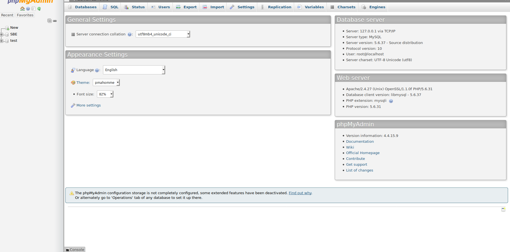

---
# You don't need to edit this file, it's empty on purpose.
# Edit theme's home layout instead if you wanna make some changes
# See: https://jekyllrb.com/docs/themes/#overriding-theme-defaults
layout: page
category: "notes"
course: "sbe306a"
year: "2019"
---
* TOC
{:toc}
# Tutorial one
This week we will talk about DMS and a quick intro for the Basic SQL statement.

## start ampps
type the following in your browser [http://localhost/ampps/](http://localhost/ampps/)
you should see


## ampps tour

click on phpmyadmin or just type [http://localhost/phpmyadmin/](http://localhost/phpmyadmin/) in your browser.
you should see


* on your left **new** we help you building new database
* select your database
* you can view your database structure or adding new table using **structure** tap
* SQL or Query tap to start writing  queries on your database

## Queries time

we created the table from **phpmyadmin** lets write an equivalent query.

### CREATE statement
```
CREATE TABLE table_name (
    coulumn1 datatype constraint,
    coulumn2 datatype constraint,
    coulumn3 datatype constraint,
);
```

For example

```
CREATE TABLE students(
    Fname VARCHAR(250),
    Lname VARCHAR(250),
    st_id INT NOT NULL,
    class_id INT NOT NULL,
    email VARCHAR(250)
);
```

so what are available data-types for SQL ? For MoreInfo you can visit [W3schools datatypes](www.w3schools.com/sql/sql_datatypes.asp)
and for constraint visit [W3schools constraint](www.w3schools.com/sql/sql_constraints.asp) and for sure it will be explained later on during the course.

### INSERT statement
```
INSERT INTO table_name (column1 ,
                        column2, 
                        column3 , ...) 
                        VALUES 
                        (value1 , 
                        value2, 
                        value3, ...);
```

for example (if you created the previous table):

```
INSERT INTO students (Fname, 
                    Lname,
                    st_id)
                    VALUES
                    ('Ayman',
                    'Anwar',
                    1);

```

**HINT : you don`t have to insert in all columns of the table because later we will learn how to update a certain record**

now once we inserted a record in our database how do we retrieve what is in our database

### SELECT statement

```
SELECT column1 , column2 , .... 
                FROM table_name;
```

To select all the records from the database

``` 
SELECT * from students;
```

**Question?** Take a moment and think is it practical to retrieve  all the data from the data base ?
#### where clause
used to select data that serves a particular condition.

```
SELECT column1, column2, ...
FROM table_name
WHERE condition; 
```

for examples

```
SELECT * from students
    WHERE st_id = 1;
```

logical expressions (AND , OR and NOT) could be used to join multiple conditions

```
SELECT column1, column2, ...
FROM table_name
WHERE condition1 AND condition2 OR condition3 ...; 
```

#### ORDER clause

we can order the retrieved data by any mean of a certain column values.

for example
```
SELECT Fname , Lname 
    FROM students
    ORDER BY st_id;
```


the update clause used to update the value of one , more or all database entries in a table.

### UPDATE statement

```
UPDATE table_name
    SET  column1 = value1, column2 = value2, ...
    WHERE condition;
```

for example
```
UPDATE students
    SET Fname = " plapla " , email = "plapla@sucks.com"
    WHERE st_id = 1;
```


we can delete one or more data base entry from our table controlled by a condition.

### DELETE statement

```
DELETE FROM table_name
    WHERE condition; 
```

for example
```
DELETE FROM students
    WHERE st_id IS NULL
```
## Select statement

we usually retrieve the data using select statement where we can retrieve one , or or all columns from a certain table

### LIMIT

LIMIT is used along with the selection to restrict it to a certain number of top rows from the table.

```
SELECT column_name(s)
FROM table_name
WHERE condition
LIMIT number; 
```
it could also be used without a condition.

### Min , Max , Count , Avg , Sum
MAX/MIN : returns minimum or maximum value in the selected column and it could be used on a subset satisfies a conditions.
```
SELECT MAX/MIN(column_name)
FROM table_name
WHERE condition;   /* optional */
```

Count : used to retrieve the number of rows that matches the criteria if exists.

```
SELECT COUNT(column_name)
FROM table_name
WHERE condition; /* optional */
```

Average : returns the average of a numeric column

```
SELECT AVG(column_name)
FROM table_name
WHERE condition; /* optional */
```

Summation : returns the sum of a specified column that matches the criteria if exists.

```
SELECT SUM(column_name)
FROM table_name
WHERE condition; /* optional */
```
### logical operators

Basic operator

| Operator        | Description     | 
| ------------- |:-------------:|
| AND     |  combine conditions with logical and in WHERE clause |
| OR     |  combine conditions with logical OR in WHERE clause |
| NOT     |  Negate operator |
| EXISTS     | used to search te presence of a row in table or a table it self      |
| ALL     | used to check wether all records satisfy the condition or not     |
| ANY     | used to check wether any records satisfy the condition or not     |
| Between     | used to search te for values in a certain range along with AND      |

More operators
**LIKE** used to search for a specified pattern in selected column usually used with text.
it uses two wildcards
1. percentage **%** represents a sequence form zero to multiple characters
2. underscore **_** represents a single character.

```
SELECT column1, column2, ...
FROM table_name
WHERE columnN LIKE pattern; 
```
Patterns: 
+ LIKE 'x%' finds any string starts with x
+ LIKE '%x' finds any string ends with x
+ LIKE '%x%' finds any string that contain s in any place
+ LIKE '_x%' finds any string have x in seconds position

**IN** operator used to check the values given found in the list or not moreover it acts like multiple **OR** statements.

```
SELECT column_name(s)
FROM table_name
WHERE column_name IN (value1, value2, ...); 
```
**AS** called aliases which acts as a renaming function to give the retrieved attribute a new name.

```
SELECT fname + lname AS Name 
WHERE condition
```

it also can be used to rename tables


## Alter statement

previously we practiced every SQL statement on its basic form what if we wants two alter attributes in a certain table.

to add new attribute for previously created table.

```
ALTER TABLE table_name
ADD column_name datatype; 
```

to drop a certain column

```
ALTER TABLE table_name
DROP COLUMN column_name; 
```

to modify datatype for a singe column

```
ALTER TABLE table_name
MODIFY COLUMN column_name datatype;
```

## SQL Constraints

used to specify rules for data in table

| Constraint    | Description |
| ------------- |:-------------:|
| NOT NULL      | Ensures that a column cannot have a NULL value |
| UNIQUE        | Ensures that all values in a column are different |
| DEFAULT        | set a default value for column |
| AUTO_INCREMENT        | auto increments records inserted into table |
| PRIMARY KEY   |  A combination of a NOT NULL and UNIQUE. Uniquely identifies each row in a table |
| FOREIGN KEY   | Uniquely identifies a row/record in another table |

SQL constraint could be specified during CREATE statement or using alter statement previously explained.
```
CREATE TABLE table_name (
    column1 datatype constraint,
    column2 datatype constraint,
    column3 datatype constraint,
    ....
);
```
**NOT NULL**

```
CREATE TABLE table_name (
    column datatype NOT NULL);
```

```
ALTER TABLE table-name MODIFY column datatype NOT NULL;
```
during the insertion we can`t neglect entering a not NULL column it will gives an error it could be solved by DEFAULT.

**UNIQUE** preferred numeric

```
 CREATE TABLE table_name (
    column datatype NOT NULL UNIQUE);
```

```
ALTER TABLE table_name 
    ADD UNIQUE (column_name);
```

**DEFAULT** value for a column

```
 CREATE TABLE table_name (
    column datatype  UNIQUE DEFAULT 'someting' );
```


Moreover about constraint next tutorial and relations.