---
# You don't need to edit this file, it's empty on purpose.
# Edit theme's home layout instead if you wanna make some changes
# See: https://jekyllrb.com/docs/themes/#overriding-theme-defaults
layout: page
category: "notes"
course: "sbe306"
year: "2019"
title: "Medical Visualization & Volume Rendering"
---
* TOC
{:toc}

## Introduction and motivation

* Medical Imaging is one of core stones of biomedical engineering and medical imaging equipment are a capital equipment in every hospital. 
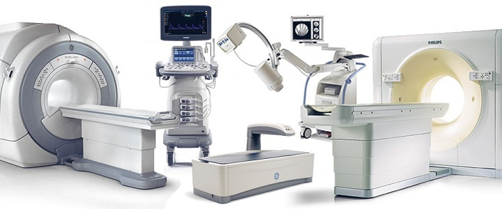

* Medical imaging is used for diagnosis as a replacement of surgical investigation.

* Advancements of technology had improved the quality of these scanners. Nowadays, these scanners can generate an accurate representation of anatomical structures of the body and can generate a large number of images for different slices with a very high resolution.

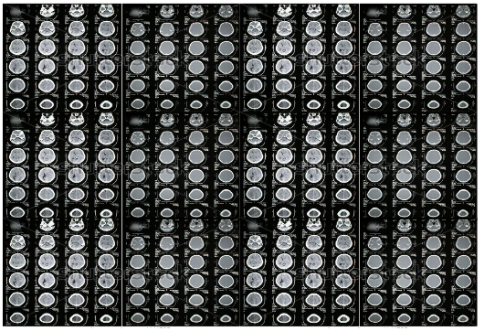
* It became more challenging to handle such amount of data produced by such machines. 

* These images are stacked together to make a 3D volume of data. 

* Volume rendering is the process of visualization of these 3D data in an interactive manner.

## Volume rendering applications

### Diagnosis

Volume rendering is crucial for diagnosis. You have the whole volume, you can navigate through it, Segment region of interest. Make measurements on it and more other functionalities that make diagnosis process more easy and affective.

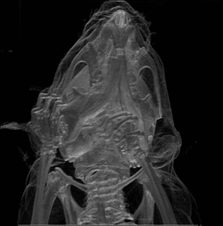

### Image guided therapy

In cancer treatment volume rendering play an important role. Patient is scanned prior to treatment and visualized as a 3D volume this allows accurate localization of tumour and minimize the adverse effect on the normal tissues.

It also used to figure out the progress of treatment. By measuring the size and the shape of the tumour to see the effectiveness of the treatment.

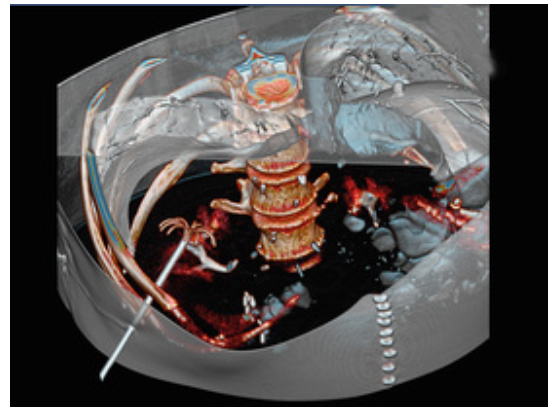

**Dental implant planning**

This is another application for image guided therapy. A software simulator based on volume rendering will use the scanned skull of the patient to plan the process of medical implant and get the best orientation and size of new implant. Actually this is the core work of one of a good market companies (360 Imaging)

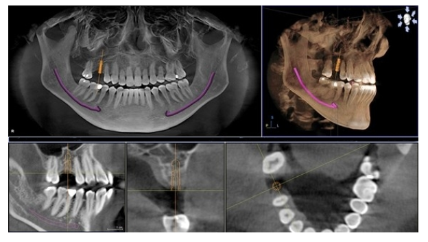

### Virtual autopsy

Post mortem imaging or forensic imaging is an alternative approach to autopsy. It is used for diagnosis of cause of death. Whole body is scanned and rendered as a 3D volume, its anatomy is explored to check the cause of death without need of autopsy.

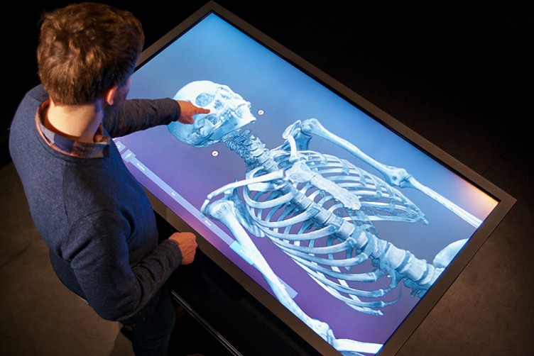

[Demo Video](https://www.tii.se/projects/autopsy)

<iframe src="https://player.vimeo.com/video/6866296?title=0&byline=0&portrait=0" width="640" height="360" frameborder="0" webkitallowfullscreen mozallowfullscreen allowfullscreen></iframe>

<a href="https://vimeo.com/6866296">The Virtual Autopsy Table</a> from <a href="https://vimeo.com/visualisering">Visualiseringscenter C</a> on <a href="https://vimeo.com">Vimeo</a>.

### 4D ultrasound imaging

In ultrasound 4D imaging of fetus is a real time volume rendering of the fetus. It could help in early detection of abnormalities of bones or any other organs.

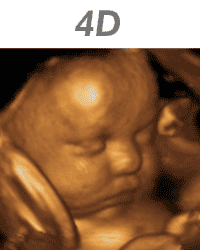

### 3D Printing

As a result of being able to get a 3D volume of medical data. We can now print them and get this objects in reality.

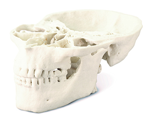
### More and more applications

There are many other application of volume rendering in medical and none medical fields. For example, none-destructive material testing using CT scanner, oil exploration and physical simulation.

## Volume Rendering Algorithms
There are many three different techniques for volume rendering 
* From voxels of volume itself (Direct volume rendering)

* Extracting polygons from volume and render them (Indirect volume rendering)

* Transform volume to another domain and Ex. Frequency domain and extract slices from it (Domain volume rendering)

Each one of  these methods are implemented with different methods.
 

### Direct Volume rendering 
* Based on ray casting algorithm 
* Volume is mapped to 2D image plane according to intersections of rays. 
* Different accumalation methods 
    * Alpha blending
    * Maximum intensity projection 
    * Average intensity projection
* Interpolation process is applied to pick up intensity value from nearest voxels.
* It is computationally expensive (You have to repeat the process for every transformation action)

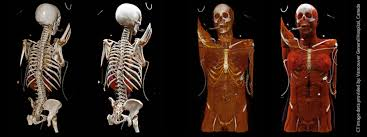

### Indirect Volume rendering (Iso-surface)

The basic idea is extracting polygons or primitives (points) from Volume and render extracted polygon itself not the volume. 

To extract polygons we have to specify what so called iso value (like a threshold we use to get meshes from volume) 

The main algorithm is Marching cubes algorithm

Different meshes configuration for different cases.

You have to do that only once unless you want to extract anther surface with different iso value

Different iso values

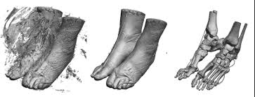

### Domain Volume rendering

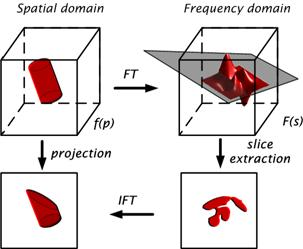

Fourier volume rendering is an example of domain based volume rendering using central slice theory.

The main advantage of it is that it reduces the complexity of spatial domain volume rendering.

## Next

Volume coloring and transfer function.

## Usefull links

[Visible Human Project Dataset](https://mri.radiology.uiowa.edu/visible_human_datasets.html)
