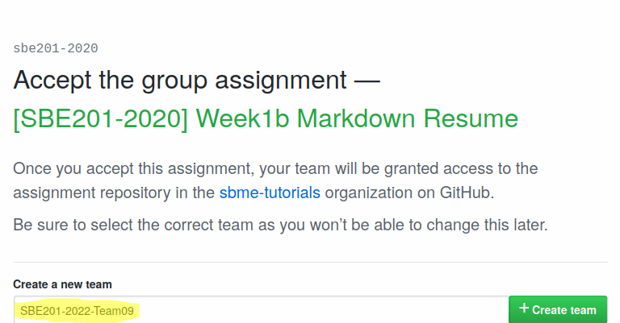

## Objectives

* Git: Collaborate as a team in a single repository using Git.
* Markdown: Use Markdown as a markup language to write simple resume.


## Prerequisites

* Read the notes of the first week  [Part 2: Basics of Git and Github]({{ site.baseurl }}){:target="_blank"}.
* Familiarity with Git basic line commands. Refer to the preprinted git cheat sheet that we have received previously ([PDF version](https://education.github.com/git-cheat-sheet-education.pdf)).
* Familiarity with Markdown formatting. Refer to the preprinted Markdown fold that we have received previously ([PDF version](https://enterprise.github.com/downloads/en/markdown-cheatsheet.pdf)).
* Install an editor for Markdown files like [VSCode](https://code.visualstudio.com/download).


## Deadline

**Saturday, 1st March 2020, 11:59 PM**.

## Assignment Registration

* Know your team id from the sheet [SBE201-2020-Teams](https://docs.google.com/spreadsheets/d/1BHVogu9KVICELiIciJ25ZzedceGEwr5tzqJxNePx-18/edit?usp=sharing).
* Go to the assignment page [\[SBE201-2020\] Week1b Markdown Resume](https://classroom.github.com/g/kfVvaVY1).
 
| If you are the team leader, create a new team using the pattern **SBE201-2022-TeamXX**, where **XX** is the team number in two digits. For example, if your team number is 9, you will use **SBE201-2022-Team09** |
|---|
|  
| Otherwise, if you are not the team leader, find your team **label** as **SBE201-2022-TeamXX**, where **XX** is the group number in two digits, then join it. If you don't find it then your team leader hasn't yet registered your team. |

* After that, team members can clone the remote repository to their local machines.

## Start working in your resume

* After cloning your repository of your team, open the folder using *Visual Studio Code*, and work in your Markdown file.
* The team should write their plain resumes in separate files. You should find **6 files**, choose the one associated with order your name appeared [SBE201-2020-Teams](https://docs.google.com/spreadsheets/d/1BHVogu9KVICELiIciJ25ZzedceGEwr5tzqJxNePx-18/edit?usp=sharing).
* Start drafting a basic resume of yours, you may use [`asem.md`](/2020/data-structures/assignments/resumes/asem) as a template.
* You can find extra guidelines in the `README.md` file of your repository.
* After finishing, add your name in the table in the `README.md` file.
* [A reference for GitHub emojis](https://gist.github.com/rxaviers/7360908)


## Submission

After finishing your changes, commit:

```bash
git commit -a -m "added my resume..."
```

Make sure you are updated with the remote repository before pushing:

```bash
git pull origin master
```

Push:

```bash
git push origin master
```

<div class="alert alert-primary" markdown="1" role="alert">

### <i class="fas fa-info-circle"></i> Notes: Public Key Authentication

You are expected to execute the following git commands too often:
    
* `git clone url`: which clones the remote repository for the first time.
* `git pull origin master`: which merges the updates on the remote repository (almost made by your teammates) into your local repository. 
* `git push origin master`: that publishes your local updates to the remote repository.
 
Each of these commands requires you to provide your username and password :angry:. It becomes boring when you frequently make changes and updates. Follow [Steps for using Public Key Authentication for accessing your GitHub repositories]({{ site.baseurl }}){:target="_blank"} that guides you towards using public key authentication instead of using the username and password.

</div>


<div class="alert alert-danger" markdown="1" role="alert">

### <i class="fas fa-info-circle"></i> Warning: Bad practices that risks your repository and team work

1. Never use the GitHub website interface to upload your work manually. This will almost ruin the work of your teammates. You should only rely on the git commands.
2. When you publish your changes, it may happen that one of your teammates has published some updates before you do, so you need to `git pull origin master` first. So **never use as a solution**: `git push -f origin master` (by adding `-f`) or `git push --force origin master` (by adding `--force` flag). This is guaranteed to ruin and overwrite your teammates work.

</div>